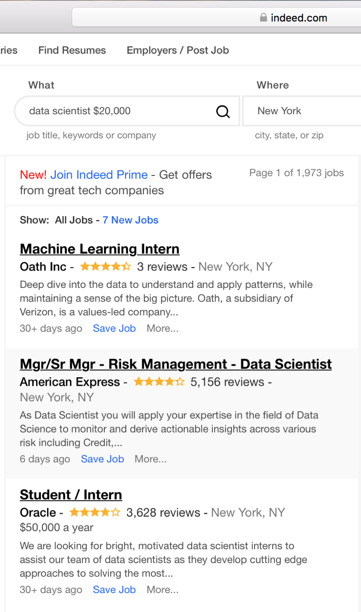
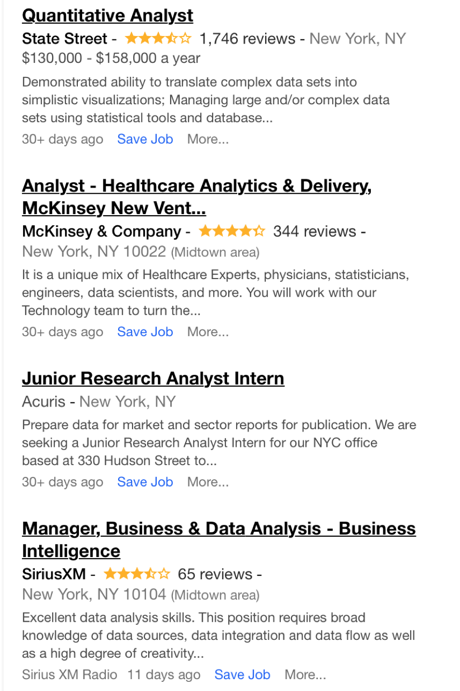
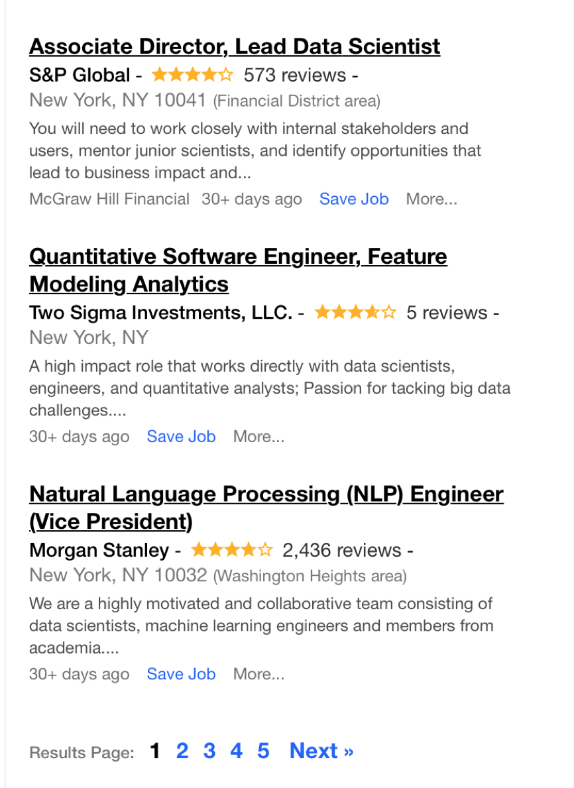

# Web Scraping for Indeed.com and Predicting Salaries

In this project, we will practice two major skills: collecting data by scraping a website and then building a binary predictor with Logistic Regression.

We are going to collect salary information on data science jobs in a variety of markets. Then using the location, title and summary of the job we will attempt to predict the salary of the job. For job posting sites, this would be extraordinarily useful. While most listings DO NOT come with salary information (as you will see in this exercise), being able to extrapolate or predict the expected salaries from other listings can help guide negotiations.

Normally, we could use regression for this task; however, we will convert this problem into classification and use Logistic Regression or any other suitable classifier.

- Question: Why would we want this to be a classification problem?
- Answer: While more precision may be better, there is a fair amount of natural variance in job salaries - predicting a range may be useful.

Therefore, the first part of the assignment will be focused on scraping Indeed.com. In the second, we'll focus on using listings with salary information to build a model and predict additional salaries.

## Scraping job listings from Indeed.com

We will be scraping job listings from Indeed.com using BeautifulSoup. Luckily, Indeed.com is a simple text page where we can easily find relevant entries.

First, look at the source of an Indeed.com page: (http://www.indeed.com/jobs?q=data+scientist+%2420%2C000&l=New+York&start=10").


#### Setup a request (using `requests`) to the URL below. Use BeautifulSoup to parse the page and extract all results (HINT: Look for div tags with class name result)

The URL here has many query parameters:

- `q` for the job search
- This is followed by "+20,000" to return results with salaries (or expected salaries >$20,000)
- `l` for a location 
- `start` for what result number to start on


```python
# Define web site URL
URL = "http://www.indeed.com/jobs?q=data+scientist+%2420%2C000&l=New+York&start=0"
```


```python
import requests
import bs4
from tqdm import tqdm
from bs4 import BeautifulSoup
```


```python
# Define Response object
source = requests.get(URL)

# Print Response object type
print(type(source))
print(source)
```

    <class 'requests.models.Response'>
    <Response [200]>


```python
# Parse text attribute of Response object (i.e. the HTML source code) and asign to soup
soup = BeautifulSoup(source.text, 'html.parser')
```


```python
# Extract all job cards on the first page of the site
job_cards = soup.find_all('div', class_='result')
```


```python
print(f'There are {len(job_cards)} jobs on each \'full\' page of the site.')
```

    There are 10 jobs on each 'full' page of the site.


```python
# Display contents of 1 job card in a 'prettified' (i.e. indented) format
print(job_cards[4].prettify())
```

    <div class=" row result" data-jk="c9035e2fafc77096" data-tn-component="organicJob" data-tu="" id="p_c9035e2fafc77096">
     <h2 class="jobtitle" id="jl_c9035e2fafc77096">
      <a class="turnstileLink" data-tn-element="jobTitle" href="/rc/clk?jk=c9035e2fafc77096&amp;fccid=6576e7250aa78c3c&amp;vjs=3" onclick="setRefineByCookie(['salest']); return rclk(this,jobmap[4],true,0);" onmousedown="return rclk(this,jobmap[4],0);" rel="noopener nofollow" target="_blank" title="Analyst - Healthcare Analytics &amp; Delivery, McKinsey New Ventures">
       Analyst - Healthcare Analytics &amp; Delivery, McKinsey New Vent...
      </a>
     </h2>
     <span class="company">
      <a href="/cmp/Mckinsey-&amp;-Company" onmousedown="this.href = appendParamsOnce(this.href, 'from=SERP&amp;campaignid=serp-linkcompanyname&amp;fromjk=c9035e2fafc77096&amp;jcid=6576e7250aa78c3c')" rel="noopener" target="_blank">
       McKinsey &amp; Company
      </a>
     </span>
     -
     <a class="ratingsLabel" data-tn-element="reviewStars" data-tn-variant="cmplinktst2" href="/cmp/Mckinsey-&amp;-Company/reviews" onmousedown="this.href = appendParamsOnce(this.href, '?campaignid=cmplinktst2&amp;from=SERP&amp;jt=Analyst+-+Healthcare+Analytics+%26+Delivery%2C+McKinsey+New+Ventures&amp;fromjk=c9035e2fafc77096&amp;jcid=6576e7250aa78c3c');" rel="noopener" target="_blank" title="Mckinsey &amp; Company reviews">
      <span class="ratings">
       <span class="rating" style="width:52.8px">
        <!-- -->
       </span>
      </span>
      <span class="slNoUnderline">
       344 reviews
      </span>
     </a>
     -
     <span class="location">
      New York, NY 10022
      <span style="font-size: smaller">
       (Midtown area)
      </span>
     </span>
     <table border="0" cellpadding="0" cellspacing="0">
      <tr>
       <td class="snip">
        <div class="">
         <span class="summary">
          It is a unique mix of Healthcare Experts, physicians, statisticians, engineers,
          <b>
           data
          </b>
          <b>
           scientists
          </b>
          , and more. You will work with our Technology team to turn the...
         </span>
        </div>
        <div class="result-link-bar-container">
         <div class="result-link-bar">
          <span class="date">
           30+ days ago
          </span>
          <span class="tt_set" id="tt_set_4">
           -
           <a class="sl resultLink save-job-link " href="#" id="sj_c9035e2fafc77096" onclick="changeJobState('c9035e2fafc77096', 'save', 'linkbar', false, ''); return false;" title="Save this job to my.indeed">
            save job
           </a>
           -
           <a class="sl resultLink more-link " href="#" id="tog_4" onclick="toggleMoreLinks('c9035e2fafc77096'); return false;">
            more...
           </a>
          </span>
          <div class="edit_note_content" id="editsaved2_c9035e2fafc77096" style="display:none;">
          </div>
          <script>
           if (!window['result_c9035e2fafc77096']) {window['result_c9035e2fafc77096'] = {};}window['result_c9035e2fafc77096']['showSource'] = false; window['result_c9035e2fafc77096']['source'] = "McKinsey \x26 Company"; window['result_c9035e2fafc77096']['loggedIn'] = false; window['result_c9035e2fafc77096']['showMyJobsLinks'] = false;window['result_c9035e2fafc77096']['undoAction'] = "unsave";window['result_c9035e2fafc77096']['relativeJobAge'] = "30+ days ago";window['result_c9035e2fafc77096']['jobKey'] = "c9035e2fafc77096"; window['result_c9035e2fafc77096']['myIndeedAvailable'] = true; window['result_c9035e2fafc77096']['showMoreActionsLink'] = window['result_c9035e2fafc77096']['showMoreActionsLink'] || true; window['result_c9035e2fafc77096']['resultNumber'] = 4; window['result_c9035e2fafc77096']['jobStateChangedToSaved'] = false; window['result_c9035e2fafc77096']['searchState'] = "q=data scientist $20,000&amp;l=New+York&amp;start=0"; window['result_c9035e2fafc77096']['basicPermaLink'] = "https://www.indeed.com"; window['result_c9035e2fafc77096']['saveJobFailed'] = false; window['result_c9035e2fafc77096']['removeJobFailed'] = false; window['result_c9035e2fafc77096']['requestPending'] = false; window['result_c9035e2fafc77096']['notesEnabled'] = true; window['result_c9035e2fafc77096']['currentPage'] = "serp"; window['result_c9035e2fafc77096']['sponsored'] = false;window['result_c9035e2fafc77096']['reportJobButtonEnabled'] = false; window['result_c9035e2fafc77096']['showMyJobsHired'] = false; window['result_c9035e2fafc77096']['showSaveForSponsored'] = false; window['result_c9035e2fafc77096']['showJobAge'] = true;
          </script>
         </div>
        </div>
        <div class="tab-container">
         <div class="more-links-container result-tab" id="tt_display_4" style="display:none;">
          <a class="close-link closeLink" href="#" onclick="toggleMoreLinks('c9035e2fafc77096'); return false;" title="Close">
          </a>
          <div class="more_actions" id="more_4">
           <ul>
            <li>
             <span class="mat">
              View all
              <a href="/q-Mckinsey-&amp;-Company-l-New-York,-NY-jobs.html" rel="nofollow">
               McKinsey &amp; Company jobs in New York, NY
              </a>
              -
              <a href="/l-New-York,-NY-jobs.html">
               New York jobs
              </a>
             </span>
            </li>
            <li>
             <span class="mat">
              Salary Search:
              <a href="/salaries/Delivery-Driver-Salaries,-New-York-NY" onmousedown="this.href = appendParamsOnce(this.href, '?campaignid=serp-more&amp;fromjk=c9035e2fafc77096&amp;from=serp-more');">
               Delivery Driver salaries in New York, NY
              </a>
             </span>
            </li>
            <li>
             <span class="mat">
              Learn more about working at
              <a href="/cmp/Mckinsey-&amp;-Company" onmousedown="this.href = appendParamsOnce(this.href, '?fromjk=c9035e2fafc77096&amp;from=serp-more&amp;campaignid=serp-more&amp;jcid=6576e7250aa78c3c');">
               Mckinsey &amp; Company
              </a>
             </span>
            </li>
            <li>
             <span class="mat">
              <a href="/cmp/Mckinsey-&amp;-Company/faq" onmousedown="this.href = appendParamsOnce(this.href, '?from=serp-more&amp;campaignid=serp-more&amp;fromjk=c9035e2fafc77096&amp;jcid=6576e7250aa78c3c');">
               Mckinsey &amp; Company questions about work, benefits, interviews and hiring process:
              </a>
              <ul>
               <li>
                <a href="/cmp/Mckinsey-&amp;-Company/faq/what-benefits-does-the-company-provide?quid=1b3djou0tak4ve6s" onmousedown="this.href = appendParamsOnce(this.href, '?from=serp-more&amp;campaignid=serp-more&amp;fromjk=c9035e2fafc77096&amp;jcid=6576e7250aa78c3c');">
                 What benefits does the company provide?
                </a>
               </li>
               <li>
                <a href="/cmp/Mckinsey-&amp;-Company/faq/if-you-were-in-charge-what-would-you-do-to-make-mckinsey-company-a-better-place-to-work?quid=1bjou59lpak95eh5" onmousedown="this.href = appendParamsOnce(this.href, '?from=serp-more&amp;campaignid=serp-more&amp;fromjk=c9035e2fafc77096&amp;jcid=6576e7250aa78c3c');">
                 If you were in charge, what would you do to make McKinsey &amp; Company a be...
                </a>
               </li>
              </ul>
             </span>
            </li>
            <li>
             <span class="mat">
              Related forums:  -
              <a href="/forum/loc/New-York-New-York.html">
               New York, New York
              </a>
              -
              <a href="/forum/cmp/Mckinsey-%26-Company.html">
               McKinsey &amp; Company
              </a>
             </span>
            </li>
           </ul>
          </div>
         </div>
         <div class="dya-container result-tab">
         </div>
         <div class="tellafriend-container result-tab email_job_content">
         </div>
         <div class="sign-in-container result-tab">
         </div>
         <div class="notes-container result-tab">
         </div>
        </div>
       </td>
      </tr>
     </table>
    </div>
    


```python
# Extract all job locations on 1st page of web site and assign to locations list
locations = [job_card.find ('span', class_='location').text 
             for job_card in job_cards]
locations
```


    ['New York, NY',
     'New York, NY',
     'New York, NY',
     'New York, NY',
     'New York, NY 10022 (Midtown area)',
     'New York, NY',
     'New York, NY 10104 (Midtown area)',
     'New York, NY 10041 (Financial District area)',
     'New York, NY',
     'New York, NY 10032 (Washington Heights area)']


```python
# Extract all companies on 1st page of web site and assign to companies list
companies = [job_card.find('span', class_='company').text
            for job_card in job_cards]
companies
```


    ['\n\n    Oath Inc',
     '\n\n    American Express',
     '\n\n    Oracle',
     '\n\n    State Street',
     '\n\n    McKinsey & Company',
     '\n    Acuris',
     '\n\n    SiriusXM',
     '\n\n    S&P Global',
     '\n\n    Two Sigma Investments, LLC.',
     '\n\n    Morgan Stanley']


```python
# Extract all job titles from 1st page of web site and assign to titles list
titles = [job_card.find('a', class_='turnstileLink').text
          for job_card in job_cards]
titles
```


    ['Machine Learning Intern',
     'Mgr/Sr Mgr - Risk Management - Data Scientist',
     'Student / Intern',
     'Quantitative Analyst',
     'Analyst - Healthcare Analytics & Delivery, McKinsey New Vent...',
     'Junior Research Analyst Intern',
     'Manager, Business & Data Analysis - Business Intelligence',
     'Associate Director, Lead Data Scientist',
     'Quantitative Software Engineer, Feature Modeling Analytics',
     'Natural Language Processing (NLP) Engineer (Vice President)']


```python
# Extract salaries from job_card and assign to salaries list.  
# Note, not all job cards have a salary.  In these cases, None will be appended to the list.
salaries = []
for job_card in job_cards:
    try:
        salaries.append(job_card.find('span', class_='no-wrap').text)
    except:
        salaries.append(None)
salaries

```


    [None,
     None,
     '\n                $50,000 a year',
     '\n                $130,000 - $158,000 a year',
     None,
     None,
     None,
     '\n                $153,000 - $195,000 a year (Indeed est.)',
     None,
     None]


# Answer
I will also extract the number of company reviews and the summary for each job, as these may be interesting predictors for the salary modeling in Question 2.


```python
# Extract number of company reviews and assign to reviews list
reviews = []
for job_card in job_cards:
    try:
        reviews.append(job_card.find('span', class_='slNoUnderline').text.split(' ')[0].replace(',',''))
    except:
        reviews.append(None)
        
reviews
```


    ['3', '5156', '3628', '1746', '344', None, '65', '573', '5', '2436']


```python
# Extract job summary and assign to summary list
summary = [job_card.find('span', class_='summary').text.strip()
          for job_card in job_cards]
summary
```


    ['Deep dive into the data to understand and apply patterns, while maintaining a sense of the big picture. Oath, a subsidiary of Verizon, is a values-led company...',
     'As Data Scientist you will apply your expertise in the field of Data Science to monitor and derive actionable insights across various risk including Credit,...',
     'We are looking for bright, motivated data scientist interns to assist our team of data scientists as they develop cutting edge approaches to solving the most...',
     'Demonstrated ability to translate complex data sets into simplistic visualizations; Managing large and/or complex data sets using statistical tools and database...',
     'It is a unique mix of Healthcare Experts, physicians, statisticians, engineers, data scientists, and more. You will work with our Technology team to turn the...',
     'Prepare data for market and sector reports for publication. We are seeking a Junior Research Analyst Intern for our NYC office based at 330 Hudson Street to...',
     'Excellent data analysis skills. This position requires broad knowledge of data sources, data integration and data flow as well as a high degree of creativity...',
     'You will need to work closely with internal stakeholders and users, mentor junior scientists, and identify opportunities that lead to business impact and...',
     'A high impact role that works directly with data scientists, engineers, and quantitative analysts; Passion for tacking big data challenges....',
     'We are a highly motivated and collaborative team consisting of data scientists, machine learning engineers and members from academia....']


## Write 4 functions to extract each item: location, company, job, and salary.

### Functions to return job card data


```python
# Define function to return location from a single job card

def extract_location_from_result(result):
    return result.find('span', class_='location').text
    
```


```python
# Define function to return company name from a single job card
# Where a company name doesn't exist, the function will return None

def extract_company_from_result(result):
    try:
        return result.find('span', class_='company').text.strip()
    except:
        return None
    return 

```


```python
# Define function to return job title from a single job card

def extract_title_from_result(result):
    return result.find('a', class_='turnstileLink').text.title()
```


```python
# Define function to return salary from a single job card
# Where a salary doesn't exist, the function will return None

def extract_salary_from_result(result):
    try:
        return result.find('span', class_='no-wrap').text.strip()
    except:
        return None  #'No Salary'
```


```python
# Define function to return number of reviews from a single job card
# Where data doesn't exist, the function will return None

def extract_review_from_result(result):
    try:
        return result.find('span', class_='slNoUnderline').text.split(' ')[0].replace(',','')
    except:
        return None
```


```python
# Define function to return summary from a single job card
# Where data doesn't exist, the function will return None

def extract_summary_from_result(result):
    try:
        return result.find('span', class_='summary').text.strip()
    except:
        return None
```


```python
# Test 4 functions defined above on first page of site

job_cards = soup.find_all('div', class_='result')

locations = [extract_location_from_result(job_card)
            for job_card in job_cards]

companies = [extract_company_from_result(job_card)
            for job_card in job_cards]

titles = [extract_title_from_result(job_card)
         for job_card in job_cards]

salaries = [extract_salary_from_result(job_card)
           for job_card in job_cards]

reviews = [extract_review_from_result(job_card)
           for job_card in job_cards]

summaries = [extract_summary_from_result(job_card)
           for job_card in job_cards]

print(f'Locations: {locations} \n\n')
print(f'Companies: {companies} \n\n')
print(f'Titles: {titles} \n\n')
print(f'Salaries: {salaries}\n\n')
print(f'Reviews: {reviews} \n\n')
print(f'Summaries: {summaries} \n\n')
```

    Locations: ['New York, NY', 'New York, NY', 'New York, NY', 'New York, NY', 'New York, NY 10022 (Midtown area)', 'New York, NY', 'New York, NY 10104 (Midtown area)', 'New York, NY 10041 (Financial District area)', 'New York, NY', 'New York, NY 10032 (Washington Heights area)'] 
    
    
    Companies: ['Oath Inc', 'American Express', 'Oracle', 'State Street', 'McKinsey & Company', 'Acuris', 'SiriusXM', 'S&P Global', 'Two Sigma Investments, LLC.', 'Morgan Stanley'] 
    
    
    Titles: ['Machine Learning Intern', 'Mgr/Sr Mgr - Risk Management - Data Scientist', 'Student / Intern', 'Quantitative Analyst', 'Analyst - Healthcare Analytics & Delivery, Mckinsey New Vent...', 'Junior Research Analyst Intern', 'Manager, Business & Data Analysis - Business Intelligence', 'Associate Director, Lead Data Scientist', 'Quantitative Software Engineer, Feature Modeling Analytics', 'Natural Language Processing (Nlp) Engineer (Vice President)'] 
    
    
    Salaries: [None, None, '$50,000 a year', '$130,000 - $158,000 a year', None, None, None, '$153,000 - $195,000 a year (Indeed est.)', None, None]
    
    
    Reviews: ['3', '5156', '3628', '1746', '344', None, '65', '573', '5', '2436'] 
    
    
    Summaries: ['Deep dive into the data to understand and apply patterns, while maintaining a sense of the big picture. Oath, a subsidiary of Verizon, is a values-led company...', 'As Data Scientist you will apply your expertise in the field of Data Science to monitor and derive actionable insights across various risk including Credit,...', 'We are looking for bright, motivated data scientist interns to assist our team of data scientists as they develop cutting edge approaches to solving the most...', 'Demonstrated ability to translate complex data sets into simplistic visualizations; Managing large and/or complex data sets using statistical tools and database...', 'It is a unique mix of Healthcare Experts, physicians, statisticians, engineers, data scientists, and more. You will work with our Technology team to turn the...', 'Prepare data for market and sector reports for publication. We are seeking a Junior Research Analyst Intern for our NYC office based at 330 Hudson Street to...', 'Excellent data analysis skills. This position requires broad knowledge of data sources, data integration and data flow as well as a high degree of creativity...', 'You will need to work closely with internal stakeholders and users, mentor junior scientists, and identify opportunities that lead to business impact and...', 'A high impact role that works directly with data scientists, engineers, and quantitative analysts; Passion for tacking big data challenges....', 'We are a highly motivated and collaborative team consisting of data scientists, machine learning engineers and members from academia....'] 
    
    


# Answer 
The data extracted by the functions above is aligned with that from Section 1.01.  This also cross-checks with the data from the web site (as per the images below).

I also tested these functions on larger datasets, and for different cities to verify alignment, but only show a subset of the testing above.







Now, to scale up our scraping, we need to accumulate more results. We can do this by examining the URL above.

- "http://www.indeed.com/jobs?q=data+scientist+%2420%2C000&l=New+York&start=10"

There are two query parameters here we can alter to collect more results, the `l=New+York` and the `start=10`. The first controls the location of the results (so we can try a different city). The second controls where in the results to start and gives 10 results (thus, we can keep incrementing by 10 to go further in the list).


```python
# Define URL template, which will be dynamically updated with cities and start points
url_template = "http://www.indeed.com/jobs?q=data+scientist+%2420%2C000&l={}&start={}"

# Define max results per city.  Max result of jobs for the cities in the list below is ~ 2,100.
# Set max_results_per_city to 3000 to ensure all these are captured.
# Cities with less than 3000 jobs will have a duplication of results (and jobs)
max_results_per_city = 3000

# Define empty results list to store parsed html code
results = []

for city in set(['New+York', 'Chicago', 'San+Francisco', 'Austin', 'Seattle', 
   'Los+Angeles', 'Philadelphia', 'Atlanta', 'Dallas', 'Pittsburgh', 
   'Portland', 'Phoenix', 'Denver', 'Houston', 'Miami']):
    print('Starting: ', city)
    for start in tqdm(range(0, max_results_per_city, 10)):
        # Grab the results from the request (as above)
        # Append to the full set of results
        URL = url_template.format(city, start)
        source = requests.get(URL)
        soup1 = BeautifulSoup(source.text, 'html.parser')
        # Include city name in results to capture the search city that returned the job
        results.append([soup1.find_all('div', class_='result'), city])
        
```

      0%|          | 0/300 [00:00<?, ?it/s]

    Starting:  Dallas


    100%|██████████| 300/300 [04:52<00:00,  1.03it/s]
      0%|          | 0/300 [00:00<?, ?it/s]

    Starting:  Chicago


    100%|██████████| 300/300 [05:02<00:00,  1.01s/it]
      0%|          | 0/300 [00:00<?, ?it/s]

    Starting:  Seattle


    100%|██████████| 300/300 [05:05<00:00,  1.02s/it]
      0%|          | 0/300 [00:00<?, ?it/s]

    Starting:  Los+Angeles


    100%|██████████| 300/300 [04:57<00:00,  1.01it/s]
      0%|          | 0/300 [00:00<?, ?it/s]

    Starting:  Pittsburgh


    100%|██████████| 300/300 [04:56<00:00,  1.01it/s]
      0%|          | 0/300 [00:00<?, ?it/s]

    Starting:  Portland


    100%|██████████| 300/300 [04:51<00:00,  1.03it/s]
      0%|          | 0/300 [00:00<?, ?it/s]

    Starting:  Philadelphia


    100%|██████████| 300/300 [04:55<00:00,  1.02it/s]
      0%|          | 0/300 [00:00<?, ?it/s]

    Starting:  Houston


    100%|██████████| 300/300 [04:52<00:00,  1.03it/s]
      0%|          | 0/300 [00:00<?, ?it/s]

    Starting:  New+York


    100%|██████████| 300/300 [04:52<00:00,  1.03it/s]
      0%|          | 0/300 [00:00<?, ?it/s]

    Starting:  Atlanta


    100%|██████████| 300/300 [05:00<00:00,  1.00s/it]
      0%|          | 0/300 [00:00<?, ?it/s]

    Starting:  Denver


    100%|██████████| 300/300 [04:49<00:00,  1.04it/s]
      0%|          | 0/300 [00:00<?, ?it/s]

    Starting:  San+Francisco


    100%|██████████| 300/300 [05:40<00:00,  1.13s/it]
      0%|          | 0/300 [00:00<?, ?it/s]

    Starting:  Miami


    100%|██████████| 300/300 [04:34<00:00,  1.09it/s]
      0%|          | 0/300 [00:00<?, ?it/s]

    Starting:  Phoenix


    100%|██████████| 300/300 [04:49<00:00,  1.04it/s]
      0%|          | 0/300 [00:00<?, ?it/s]

    Starting:  Austin


    100%|██████████| 300/300 [05:28<00:00,  1.10s/it]


```python
# Print number of pages (with 10 jobs each) that have been scraped
# Note, there will be significant duplication of data for cities with far fewer jobs than 3000
print(f'{len(results)} pages have been scraped.')
```

    4500 pages have been scraped.


#### Use the functions you wrote above to parse out the 4 fields - location, title, company and salary. Create a dataframe from the results with those 4 columns.


```python
# Make a back-up copy of the results list
results_back_up = results
```


```python
# Define 5 lists to store city, location, company, title and salary data for each job
cities = []
locations = []
companies = []
titles = []
salaries = []
reviews = []
summaries = []

# Define a progress counter to show progress as the for loop below executes
progress_counter = 0

# Extract the jobs (usually 10) for each page in the results list, and then extract the location, company,
# title and salary for each job; appending data to the appropriate list
for page in results:
    jobs  = page[0]
    search_city = page[1]
    
    # Print progress counter at every 1000 pages
    progress_counter += 1
    if progress_counter % 500 == 0:
        print(f'Page {progress_counter} of {len(results)}.')
        
    for job in jobs:
        cities.append(search_city)        
        locations.append(extract_location_from_result(job))
        companies.append(extract_company_from_result(job))       
        titles.append(extract_title_from_result(job))
        salaries.append(extract_salary_from_result(job))
        reviews.append(extract_review_from_result(job))
        summaries.append(extract_summary_from_result(job))
        

# Define DataFrame with city, location, title, company and salary data
col_names = ['City', 'Location', 'Title', 'Company', 'Reviews', 'Summary', 'Salary']
data = [cities, locations, titles, companies, reviews, summaries, salaries]
df = pd.DataFrame(dict(list(zip(col_names, data))))
```

    Page 500 of 4500.
    Page 1000 of 4500.
    Page 1500 of 4500.
    Page 2000 of 4500.
    Page 2500 of 4500.
    Page 3000 of 4500.
    Page 3500 of 4500.
    Page 4000 of 4500.
    Page 4500 of 4500.


##### Short EDA of data


```python
# Make a back-up copy of the jobs data DataFrame
df_back_up = df.copy()
```


```python
# Inspect DataFrame
df.head()
```


<div>
<style scoped>
    .dataframe tbody tr th:only-of-type {
        vertical-align: middle;
    }

    .dataframe tbody tr th {
        vertical-align: top;
    }

    .dataframe thead th {
        text-align: right;
    }
</style>
<table border="1" class="dataframe">
  <thead>
    <tr style="text-align: right;">
      <th></th>
      <th>City</th>
      <th>Company</th>
      <th>Location</th>
      <th>Reviews</th>
      <th>Salary</th>
      <th>Summary</th>
      <th>Title</th>
    </tr>
  </thead>
  <tbody>
    <tr>
      <th>0</th>
      <td>Dallas</td>
      <td>STATinMED Research</td>
      <td>Plano, TX 75093</td>
      <td>2</td>
      <td>None</td>
      <td>Develop study statistical analysis plans, fina...</td>
      <td>Statistical Analyst</td>
    </tr>
    <tr>
      <th>1</th>
      <td>Dallas</td>
      <td>DeWolff, Boberg &amp; Associates</td>
      <td>Dallas, TX</td>
      <td>30</td>
      <td>None</td>
      <td>Decipher and interpret large amounts of data t...</td>
      <td>Research Analyst Intern (Part-Time)</td>
    </tr>
    <tr>
      <th>2</th>
      <td>Dallas</td>
      <td>Gartner</td>
      <td>Irving, TX</td>
      <td>251</td>
      <td>None</td>
      <td>Ability to construct sub-hypotheses around a g...</td>
      <td>Jr Research Analyst</td>
    </tr>
    <tr>
      <th>3</th>
      <td>Dallas</td>
      <td>The Salvation Army</td>
      <td>Dallas, TX</td>
      <td>7804</td>
      <td>$18 - $20 an hour</td>
      <td>Plans, directs, supervises and evaluates stati...</td>
      <td>Divisional Statistician</td>
    </tr>
    <tr>
      <th>4</th>
      <td>Dallas</td>
      <td>Hitachi Consulting Corporation US</td>
      <td>Dallas, TX</td>
      <td>153</td>
      <td>$109,000 - $139,000 a year (Indeed est.)</td>
      <td>The Data Scientist designs, builds and maintai...</td>
      <td>Sr Consultant Data Scientist</td>
    </tr>
  </tbody>
</table>
</div>


```python
df.tail()
```


<div>
<style scoped>
    .dataframe tbody tr th:only-of-type {
        vertical-align: middle;
    }

    .dataframe tbody tr th {
        vertical-align: top;
    }

    .dataframe thead th {
        text-align: right;
    }
</style>
<table border="1" class="dataframe">
  <thead>
    <tr style="text-align: right;">
      <th></th>
      <th>City</th>
      <th>Company</th>
      <th>Location</th>
      <th>Reviews</th>
      <th>Salary</th>
      <th>Summary</th>
      <th>Title</th>
    </tr>
  </thead>
  <tbody>
    <tr>
      <th>44925</th>
      <td>Austin</td>
      <td>Indeed</td>
      <td>Austin, TX 78731</td>
      <td>265</td>
      <td>None</td>
      <td>Collaborate with other product marketers, desi...</td>
      <td>Product Marketing Manager</td>
    </tr>
    <tr>
      <th>44926</th>
      <td>Austin</td>
      <td>DMGT</td>
      <td>Austin, TX</td>
      <td>3</td>
      <td>None</td>
      <td>Senior Data Scientist. The Senior Data Scienti...</td>
      <td>Senior Data Scientist</td>
    </tr>
    <tr>
      <th>44927</th>
      <td>Austin</td>
      <td>RockBridge Search &amp; Recruitment</td>
      <td>Austin, TX</td>
      <td>None</td>
      <td>None</td>
      <td>This QRA Analyst will have direct experience r...</td>
      <td>Alm - Quantitative Risk Analyst</td>
    </tr>
    <tr>
      <th>44928</th>
      <td>Austin</td>
      <td>SparkCognition</td>
      <td>Austin, TX 78759 (Arboretum area)</td>
      <td>3</td>
      <td>None</td>
      <td>SparkCognition is seeking an innovative data s...</td>
      <td>Senior Data Scientist – Malware &amp; Security</td>
    </tr>
    <tr>
      <th>44929</th>
      <td>Austin</td>
      <td>RockBridge Search &amp; Recruitment</td>
      <td>Austin, TX</td>
      <td>None</td>
      <td>None</td>
      <td>This Financial Risk Quantitative Risk Analyst ...</td>
      <td>Financial Risk - Quantitative Risk Analyst</td>
    </tr>
  </tbody>
</table>
</div>


```python
df.shape
```


    (44930, 7)


```python
df.describe()
```


<div>
<style scoped>
    .dataframe tbody tr th:only-of-type {
        vertical-align: middle;
    }

    .dataframe tbody tr th {
        vertical-align: top;
    }

    .dataframe thead th {
        text-align: right;
    }
</style>
<table border="1" class="dataframe">
  <thead>
    <tr style="text-align: right;">
      <th></th>
      <th>City</th>
      <th>Company</th>
      <th>Location</th>
      <th>Reviews</th>
      <th>Salary</th>
      <th>Summary</th>
      <th>Title</th>
    </tr>
  </thead>
  <tbody>
    <tr>
      <th>count</th>
      <td>44930</td>
      <td>44929</td>
      <td>44930</td>
      <td>25336</td>
      <td>5193</td>
      <td>44930</td>
      <td>44930</td>
    </tr>
    <tr>
      <th>unique</th>
      <td>15</td>
      <td>1820</td>
      <td>688</td>
      <td>511</td>
      <td>309</td>
      <td>4335</td>
      <td>4152</td>
    </tr>
    <tr>
      <th>top</th>
      <td>Chicago</td>
      <td>RockBridge Search &amp; Recruitment</td>
      <td>Austin, TX</td>
      <td>2</td>
      <td>$80,000 - $90,000 a year</td>
      <td>This QRA Analyst will have direct experience r...</td>
      <td>Senior Data Scientist</td>
    </tr>
    <tr>
      <th>freq</th>
      <td>3000</td>
      <td>1668</td>
      <td>2102</td>
      <td>1926</td>
      <td>546</td>
      <td>834</td>
      <td>3483</td>
    </tr>
  </tbody>
</table>
</div>


```python
df.isnull().sum()
```


    City            0
    Company         1
    Location        0
    Reviews     19594
    Salary      39737
    Summary         0
    Title           0
    dtype: int64


# Answer 
There are a lot of jobs without salary data and company review numbers.  These will need to be managed later on. 


```python
# Show how many jobs have salary information for each city
df.groupby('City')[['Salary']].count()
```


<div>
<style scoped>
    .dataframe tbody tr th:only-of-type {
        vertical-align: middle;
    }

    .dataframe tbody tr th {
        vertical-align: top;
    }

    .dataframe thead th {
        text-align: right;
    }
</style>
<table border="1" class="dataframe">
  <thead>
    <tr style="text-align: right;">
      <th></th>
      <th>Salary</th>
    </tr>
    <tr>
      <th>City</th>
      <th></th>
    </tr>
  </thead>
  <tbody>
    <tr>
      <th>Atlanta</th>
      <td>591</td>
    </tr>
    <tr>
      <th>Austin</th>
      <td>634</td>
    </tr>
    <tr>
      <th>Chicago</th>
      <td>295</td>
    </tr>
    <tr>
      <th>Dallas</th>
      <td>863</td>
    </tr>
    <tr>
      <th>Denver</th>
      <td>545</td>
    </tr>
    <tr>
      <th>Houston</th>
      <td>332</td>
    </tr>
    <tr>
      <th>Los+Angeles</th>
      <td>528</td>
    </tr>
    <tr>
      <th>Miami</th>
      <td>310</td>
    </tr>
    <tr>
      <th>New+York</th>
      <td>142</td>
    </tr>
    <tr>
      <th>Philadelphia</th>
      <td>288</td>
    </tr>
    <tr>
      <th>Phoenix</th>
      <td>39</td>
    </tr>
    <tr>
      <th>Pittsburgh</th>
      <td>18</td>
    </tr>
    <tr>
      <th>Portland</th>
      <td>36</td>
    </tr>
    <tr>
      <th>San+Francisco</th>
      <td>83</td>
    </tr>
    <tr>
      <th>Seattle</th>
      <td>489</td>
    </tr>
  </tbody>
</table>
</div>


Lastly, we need to clean up salary data. 

1. Only a small number of the scraped results have salary information - only these will be used for modeling.
1. Some of the salaries are not yearly but hourly or weekly, these will not be useful to us for now.
1. Some of the entries may be duplicated.
1. The salaries are given as text and usually with ranges.

#### Find the entries with annual salary entries, by filtering the entries without salaries or salaries that are not yearly (filter those that refer to hour or week). Also, remove duplicate entries.


```python
# Inspect salary column to understand cleansing requirements
df.Salary.value_counts()
```


    $80,000 - $90,000 a year                    546
    $150,000 - $180,000 a year                  465
    $47,000 - $55,000 a year                    289
    $150,000 - $165,000 a year                  281
    $35 - $38 an hour                           280
    $100,000 - $175,000 a year                  280
    $150,000 a year                             275
    $125,000 a year                             271
    $25 an hour                                 271
    $120,000 - $150,000 a year                  254
    $17.50 - $20.40 an hour                     247
    $20 - $28 an hour                           247
    $180,000 - $200,000 a year                  241
    $160,000 - $180,000 a year                  222
    $22 - $30 an hour                           117
    $27 - $30 an hour                           117
    $59,708 - $72,246 a year                     55
    $122,000 - $155,000 a year (Indeed est.)     25
    $32,000 - $41,000 a year (Indeed est.)       18
    $115,000 - $146,000 a year (Indeed est.)     18
    $106,000 - $135,000 a year (Indeed est.)     16
    $82,000 - $104,000 a year (Indeed est.)      16
    $90,000 - $115,000 a year (Indeed est.)      15
    $138,000 - $176,000 a year (Indeed est.)     14
    $75,000 - $95,000 a year (Indeed est.)       13
    $90,000 - $114,000 a year (Indeed est.)      12
    $5,666 - $6,500 a month                      12
    $92,000 - $117,000 a year (Indeed est.)      11
    $119,000 - $151,000 a year (Indeed est.)     10
    $109,000 - $138,000 a year (Indeed est.)     10
                                               ... 
    $50,939 - $76,408 a year                      1
    $15.02 an hour                                1
    $67,200 - $100,800 a year                     1
    $36,486 - $46,907 a year                      1
    $43.33 an hour                                1
    $75,600 - $115,000 a year                     1
    $4,599 - $6,066 a month                       1
    $2,794 - $3,708 a month                       1
    $103,000 - $131,000 a year (Indeed est.)      1
    $45,000 - $55,000 a year                      1
    $44,986 - $103,739 a year                     1
    $76,050 - $99,735 a year                      1
    $4,625 - $6,423 a month                       1
    $110,000 - $130,000 a year                    1
    $170,000 - $185,000 a year                    1
    $136,000 - $173,000 a year (Indeed est.)      1
    $100,000 - $135,000 a year                    1
    $101,000 - $129,000 a year (Indeed est.)      1
    $45,703 - $105,392 a year                     1
    $18 - $20 an hour                             1
    $80 - $85 an hour                             1
    $200,000 - $300,000 a year                    1
    $5,229 - $6,862 a month                       1
    $25.77 - $38.65 an hour                       1
    $62,917 a year                                1
    $4,585 - $6,759 a month                       1
    $53,832 - $80,000 a year                      1
    $47,686 - $64,320 a year                      1
    $84,000 - $104,000 a year                     1
    $40 - $45 an hour                             1
    Name: Salary, Length: 309, dtype: int64


```python
# Drop duplicate rows from df and keep the first instance of each duplicate row
# This drop will include the duplicate data scraped for cities with less than 3,000 jobs
# Note, I am only dropping rows that have duplicate city, location, job title, company and salary data
# I've captured the number of company reviews and job summaries as additional fields, and won't 
# consider these fields in the identification of duplicate rows
print(f'DF shape before dropping duplicates: {df.shape}')
df.drop_duplicates(subset=
                   ['City', 'Location', 'Title', 'Company', 'Salary'], keep='first', inplace=True)
print(f'DF shape after dropping duplicates: {df.shape}')
```

    DF shape before dropping duplicates: (44930, 7)
    DF shape after dropping duplicates: (5341, 7)


```python
# Remove rows from df, where Salary is None, and display shape of resulting df
mask = df.Salary.notnull()
df = df.loc[mask,:]
df.shape
```


    (423, 7)


```python
# Remove rows from df, where Salary is not specified as an annual figure
mask = df.Salary.str.contains('a year')
df = df.loc[mask,:]
df.shape
```


    (323, 7)


```python
df.head(20)
```


<div>
<style scoped>
    .dataframe tbody tr th:only-of-type {
        vertical-align: middle;
    }

    .dataframe tbody tr th {
        vertical-align: top;
    }

    .dataframe thead th {
        text-align: right;
    }
</style>
<table border="1" class="dataframe">
  <thead>
    <tr style="text-align: right;">
      <th></th>
      <th>City</th>
      <th>Company</th>
      <th>Location</th>
      <th>Reviews</th>
      <th>Salary</th>
      <th>Summary</th>
      <th>Title</th>
    </tr>
  </thead>
  <tbody>
    <tr>
      <th>4</th>
      <td>Dallas</td>
      <td>Hitachi Consulting Corporation US</td>
      <td>Dallas, TX</td>
      <td>153</td>
      <td>$109,000 - $139,000 a year (Indeed est.)</td>
      <td>The Data Scientist designs, builds and maintai...</td>
      <td>Sr Consultant Data Scientist</td>
    </tr>
    <tr>
      <th>8</th>
      <td>Dallas</td>
      <td>7-Eleven</td>
      <td>Irving, TX</td>
      <td>7125</td>
      <td>$101,000 - $129,000 a year (Indeed est.)</td>
      <td>Work closely with data engineersto ensure the ...</td>
      <td>Sr Data Scientist</td>
    </tr>
    <tr>
      <th>192</th>
      <td>Dallas</td>
      <td>Workbridge Associates</td>
      <td>Dallas, TX</td>
      <td>36</td>
      <td>$95,000 - $120,000 a year</td>
      <td>Experience with data modeling, analysis, progr...</td>
      <td>Full-Stack Software Engineer (Predictive Analy...</td>
    </tr>
    <tr>
      <th>213</th>
      <td>Dallas</td>
      <td>A+ Consulting</td>
      <td>Plano, TX</td>
      <td>None</td>
      <td>$140,000 - $160,000 a year</td>
      <td>This is a direct hire position - not contract....</td>
      <td>Principal Machine Learning/Nlp Engineer-Architect</td>
    </tr>
    <tr>
      <th>216</th>
      <td>Dallas</td>
      <td>Platform by Per Scholas</td>
      <td>Dallas, TX</td>
      <td>None</td>
      <td>$50,000 - $60,000 a year</td>
      <td>Java, Oracle DB, Shell Scripting, SDLC and Cod...</td>
      <td>Data Scientist/Analyst</td>
    </tr>
    <tr>
      <th>217</th>
      <td>Dallas</td>
      <td>HRK Solutions</td>
      <td>Dallas, TX</td>
      <td>None</td>
      <td>$75,000 - $130,000 a year</td>
      <td>Data Scientist - Python, R, &amp; SAS. ETL / Data ...</td>
      <td>Sr. Software Engineer</td>
    </tr>
    <tr>
      <th>221</th>
      <td>Dallas</td>
      <td>The We Are Big Data Scientists Company</td>
      <td>Dallas, TX</td>
      <td>None</td>
      <td>$73,000 - $81,000 a year</td>
      <td>We employ numerous roles including data scient...</td>
      <td>Technical Writer I</td>
    </tr>
    <tr>
      <th>240</th>
      <td>Dallas</td>
      <td>Camden Kelly</td>
      <td>Dallas, TX</td>
      <td>None</td>
      <td>$95,000 - $115,000 a year</td>
      <td>Effectively present the story that the data te...</td>
      <td>Data Scientist – Articulate Data’S Story &amp; Get...</td>
    </tr>
    <tr>
      <th>254</th>
      <td>Dallas</td>
      <td>Arbor Diagnostics</td>
      <td>Dallas, TX 75234</td>
      <td>None</td>
      <td>$120,000 - $150,000 a year</td>
      <td>Managing the implementation of data warehouse ...</td>
      <td>Clinical Informatics Director</td>
    </tr>
    <tr>
      <th>271</th>
      <td>Dallas</td>
      <td>Hunt Around Solutions</td>
      <td>Dallas, TX</td>
      <td>None</td>
      <td>$150,000 a year</td>
      <td>Interact with customers’ Data Scientists and B...</td>
      <td>Presales Big Data Consultant</td>
    </tr>
    <tr>
      <th>273</th>
      <td>Dallas</td>
      <td>KeyStaff Inc.</td>
      <td>Irving, TX</td>
      <td>10</td>
      <td>$80,000 - $90,000 a year</td>
      <td>Interpret analytical or stability data. Enter ...</td>
      <td>Sr. Product Development Scientist In Food Manu...</td>
    </tr>
    <tr>
      <th>274</th>
      <td>Dallas</td>
      <td>Keystaff Inc</td>
      <td>Euless, TX</td>
      <td>10</td>
      <td>$80,000 - $90,000 a year</td>
      <td>Interpret analytical or stability data. Enter ...</td>
      <td>Product Development Scientist</td>
    </tr>
    <tr>
      <th>352</th>
      <td>Dallas</td>
      <td>Kleinfelder, Inc.</td>
      <td>Irving, TX</td>
      <td>58</td>
      <td>$32,000 - $41,000 a year (Indeed est.)</td>
      <td>We are engineers, scientists, and construction...</td>
      <td>Construction Materials Testing Technician</td>
    </tr>
    <tr>
      <th>396</th>
      <td>Dallas</td>
      <td>JAMY INTERACTIVE,INC</td>
      <td>Dallas, TX</td>
      <td>None</td>
      <td>$115,000 - $146,000 a year (Indeed est.)</td>
      <td>Big Data environments:. Designs, develops, and...</td>
      <td>Senior Data Scientist</td>
    </tr>
    <tr>
      <th>900</th>
      <td>Dallas</td>
      <td>AIC Talent Solutions</td>
      <td>Lewisville, TX</td>
      <td>None</td>
      <td>$107,000 - $137,000 a year (Indeed est.)</td>
      <td>Collaborate cross-functionally with data scien...</td>
      <td>Senior Java Developer</td>
    </tr>
    <tr>
      <th>3126</th>
      <td>Chicago</td>
      <td>Jobspring Partners</td>
      <td>Chicago, IL</td>
      <td>18</td>
      <td>$115,000 - $125,000 a year</td>
      <td>20% Data management. A well-known enterprise c...</td>
      <td>Machine Learning Engineer</td>
    </tr>
    <tr>
      <th>3155</th>
      <td>Chicago</td>
      <td>Jobspring Partners</td>
      <td>Chicago, IL</td>
      <td>18</td>
      <td>$170,000 - $220,000 a year</td>
      <td>Experience building teams of high caliber data...</td>
      <td>Principal Machine Learning Engineer</td>
    </tr>
    <tr>
      <th>3156</th>
      <td>Chicago</td>
      <td>Workbridge Associates</td>
      <td>Chicago, IL</td>
      <td>36</td>
      <td>$130,000 - $180,000 a year</td>
      <td>100% Hands on working with a team of 12+ data ...</td>
      <td>Machine Learning Architect</td>
    </tr>
    <tr>
      <th>3161</th>
      <td>Chicago</td>
      <td>SymbaSync</td>
      <td>Chicago, IL</td>
      <td>None</td>
      <td>$125,000 - $135,000 a year</td>
      <td>You will work with architects and engineers on...</td>
      <td>Senior Developer - Backend - Chicago</td>
    </tr>
    <tr>
      <th>3181</th>
      <td>Chicago</td>
      <td>Robert Walters</td>
      <td>Chicago, IL</td>
      <td>45</td>
      <td>$100,000 - $120,000 a year</td>
      <td>Statistical and machine learning methods for f...</td>
      <td>Sr. Quantitative Analyst</td>
    </tr>
  </tbody>
</table>
</div>


```python
df.tail(20)
```


<div>
<style scoped>
    .dataframe tbody tr th:only-of-type {
        vertical-align: middle;
    }

    .dataframe tbody tr th {
        vertical-align: top;
    }

    .dataframe thead th {
        text-align: right;
    }
</style>
<table border="1" class="dataframe">
  <thead>
    <tr style="text-align: right;">
      <th></th>
      <th>City</th>
      <th>Company</th>
      <th>Location</th>
      <th>Reviews</th>
      <th>Salary</th>
      <th>Summary</th>
      <th>Title</th>
    </tr>
  </thead>
  <tbody>
    <tr>
      <th>39060</th>
      <td>Phoenix</td>
      <td>Arizona Supreme Court</td>
      <td>Phoenix, AZ 85007 (Central City area)</td>
      <td>13</td>
      <td>$62,917 a year</td>
      <td>The position is required to perform operations...</td>
      <td>Sr. Statistician - Specialist Vii (Job 2239)</td>
    </tr>
    <tr>
      <th>39261</th>
      <td>Phoenix</td>
      <td>RevolutionParts</td>
      <td>Phoenix, AZ</td>
      <td>None</td>
      <td>$92,000 - $117,000 a year (Indeed est.)</td>
      <td>As a data scientist you’ll measure, analyze, a...</td>
      <td>Ux Designer</td>
    </tr>
    <tr>
      <th>39263</th>
      <td>Phoenix</td>
      <td>SR International Inc.</td>
      <td>Phoenix, AZ</td>
      <td>5</td>
      <td>$109,000 - $138,000 a year (Indeed est.)</td>
      <td>Proven industry experience of atleast 2-3 year...</td>
      <td>Data Scientist</td>
    </tr>
    <tr>
      <th>39264</th>
      <td>Phoenix</td>
      <td>Raps Consuling</td>
      <td>Phoenix, AZ</td>
      <td>None</td>
      <td>$90,000 - $114,000 a year (Indeed est.)</td>
      <td>Job Title-Data Scientist*. Knowledge of ML mod...</td>
      <td>Data Scientist</td>
    </tr>
    <tr>
      <th>41962</th>
      <td>Austin</td>
      <td>Department of the Interior</td>
      <td>Austin, TX</td>
      <td>514</td>
      <td>$33,394 - $61,403 a year</td>
      <td>Collect Scientific Data. Construct new data co...</td>
      <td>Hydrologic Technician, Gs-1316-05/06/07 (Deu-P...</td>
    </tr>
    <tr>
      <th>41963</th>
      <td>Austin</td>
      <td>Travis County</td>
      <td>Austin, TX</td>
      <td>60</td>
      <td>$32,345 - $33,545 a year</td>
      <td>Collects and directs data gathering activities...</td>
      <td>Educational Instructional Specialist</td>
    </tr>
    <tr>
      <th>42049</th>
      <td>Austin</td>
      <td>Strategic IT Staffing</td>
      <td>Austin, TX</td>
      <td>4</td>
      <td>$117,000 - $149,000 a year (Indeed est.)</td>
      <td>Doing all this with an exceptional group of so...</td>
      <td>Senior Devops Engineer</td>
    </tr>
    <tr>
      <th>42085</th>
      <td>Austin</td>
      <td>Far Harbor, LLC</td>
      <td>Austin, TX</td>
      <td>None</td>
      <td>$84,000 - $104,000 a year</td>
      <td>Familiarity with complex survey data (clustere...</td>
      <td>Public Health Research Statistician</td>
    </tr>
    <tr>
      <th>42087</th>
      <td>Austin</td>
      <td>HuntSource</td>
      <td>Austin, TX</td>
      <td>None</td>
      <td>$95,000 - $120,000 a year</td>
      <td>Lead data science initiatives from discovery t...</td>
      <td>Machine Learning / Ai Engineer</td>
    </tr>
    <tr>
      <th>42090</th>
      <td>Austin</td>
      <td>Cerebri AI</td>
      <td>Austin, TX</td>
      <td>None</td>
      <td>$90,000 - $130,000 a year</td>
      <td>Experience with data governance and managing l...</td>
      <td>Database Architect</td>
    </tr>
    <tr>
      <th>42094</th>
      <td>Austin</td>
      <td>DDMR</td>
      <td>Austin, TX</td>
      <td>None</td>
      <td>$55,000 - $85,000 a year</td>
      <td>You'll be dealing with very technical engineer...</td>
      <td>Technical Product Manager - Data Services</td>
    </tr>
    <tr>
      <th>42100</th>
      <td>Austin</td>
      <td>DDMR</td>
      <td>Austin, TX</td>
      <td>None</td>
      <td>$55,000 - $85,000 a year</td>
      <td>You'll be dealing with very technical engineer...</td>
      <td>Technical Product Manager - Analytics Solutions</td>
    </tr>
    <tr>
      <th>42106</th>
      <td>Austin</td>
      <td>Interactive Resources</td>
      <td>Austin, TX</td>
      <td>11</td>
      <td>$130,000 - $145,000 a year</td>
      <td>Product development engineer or scientist in a...</td>
      <td>Principal Polymer Engineer</td>
    </tr>
    <tr>
      <th>42108</th>
      <td>Austin</td>
      <td>Prestige Staffing</td>
      <td>Austin, TX 78759 (Arboretum area)</td>
      <td>127</td>
      <td>$100,000 - $140,000 a year</td>
      <td>Responsible for coaching and leading the Data ...</td>
      <td>Data Science Manager</td>
    </tr>
    <tr>
      <th>42116</th>
      <td>Austin</td>
      <td>Pisika</td>
      <td>Austin, TX 78758 (North Austin area)</td>
      <td>None</td>
      <td>$80,000 - $110,000 a year</td>
      <td>Build dashboards, data visualizations, and too...</td>
      <td>Data Scientist</td>
    </tr>
    <tr>
      <th>42122</th>
      <td>Austin</td>
      <td>Prestige Staffing</td>
      <td>Austin, TX 78759 (Arboretum area)</td>
      <td>127</td>
      <td>$100,000 - $150,000 a year</td>
      <td>Python, Lab, Data Science, consulting, compute...</td>
      <td>Data Scientist</td>
    </tr>
    <tr>
      <th>42134</th>
      <td>Austin</td>
      <td>Meador Staffing of Austin</td>
      <td>Austin, TX</td>
      <td>None</td>
      <td>$100,000 - $175,000 a year</td>
      <td>Experience in big data and machine learning sy...</td>
      <td>Online Marketing Scientist/Engineer</td>
    </tr>
    <tr>
      <th>42440</th>
      <td>Austin</td>
      <td>General Assembly</td>
      <td>Austin, TX</td>
      <td>131</td>
      <td>$125,000 - $160,000 a year (Indeed est.)</td>
      <td>We are looking for a Data Scientist to facilit...</td>
      <td>Lead Data Science Immersive Instructor</td>
    </tr>
    <tr>
      <th>42445</th>
      <td>Austin</td>
      <td>DMGT</td>
      <td>Austin, TX</td>
      <td>3</td>
      <td>$102,000 - $130,000 a year (Indeed est.)</td>
      <td>Senior Data Scientist. The Senior Data Scienti...</td>
      <td>Senior Data Scientist</td>
    </tr>
    <tr>
      <th>42448</th>
      <td>Austin</td>
      <td>SparkCognition</td>
      <td>Austin, TX 78759 (Arboretum area)</td>
      <td>3</td>
      <td>$97,000 - $123,000 a year (Indeed est.)</td>
      <td>SparkCognition is seeking an innovative data s...</td>
      <td>Senior Data Scientist – Malware &amp; Security</td>
    </tr>
  </tbody>
</table>
</div>


#### Write a function that takes a salary string and converts it to a number, averaging a salary range if necessary.


```python
# Define Indeed_Estimate column, which flags salaries provided by Indeed as estimates 
# with a 1, else 0.  I may want to separate these later and don't want to lose the information.
df['Indeed_Estimate'] = df['Salary'].map(lambda x: 1 if 'Indeed est.' in x else 0)

```


```python
# Print number of salaries flagged as Indeed estimates
df.Indeed_Estimate.sum()
```


    109


```python
df.head(20)
```


<div>
<style scoped>
    .dataframe tbody tr th:only-of-type {
        vertical-align: middle;
    }

    .dataframe tbody tr th {
        vertical-align: top;
    }

    .dataframe thead th {
        text-align: right;
    }
</style>
<table border="1" class="dataframe">
  <thead>
    <tr style="text-align: right;">
      <th></th>
      <th>City</th>
      <th>Company</th>
      <th>Location</th>
      <th>Reviews</th>
      <th>Salary</th>
      <th>Summary</th>
      <th>Title</th>
      <th>Indeed_Estimate</th>
    </tr>
  </thead>
  <tbody>
    <tr>
      <th>4</th>
      <td>Dallas</td>
      <td>Hitachi Consulting Corporation US</td>
      <td>Dallas, TX</td>
      <td>153</td>
      <td>$109,000 - $139,000 a year (Indeed est.)</td>
      <td>The Data Scientist designs, builds and maintai...</td>
      <td>Sr Consultant Data Scientist</td>
      <td>1</td>
    </tr>
    <tr>
      <th>8</th>
      <td>Dallas</td>
      <td>7-Eleven</td>
      <td>Irving, TX</td>
      <td>7125</td>
      <td>$101,000 - $129,000 a year (Indeed est.)</td>
      <td>Work closely with data engineersto ensure the ...</td>
      <td>Sr Data Scientist</td>
      <td>1</td>
    </tr>
    <tr>
      <th>192</th>
      <td>Dallas</td>
      <td>Workbridge Associates</td>
      <td>Dallas, TX</td>
      <td>36</td>
      <td>$95,000 - $120,000 a year</td>
      <td>Experience with data modeling, analysis, progr...</td>
      <td>Full-Stack Software Engineer (Predictive Analy...</td>
      <td>0</td>
    </tr>
    <tr>
      <th>213</th>
      <td>Dallas</td>
      <td>A+ Consulting</td>
      <td>Plano, TX</td>
      <td>None</td>
      <td>$140,000 - $160,000 a year</td>
      <td>This is a direct hire position - not contract....</td>
      <td>Principal Machine Learning/Nlp Engineer-Architect</td>
      <td>0</td>
    </tr>
    <tr>
      <th>216</th>
      <td>Dallas</td>
      <td>Platform by Per Scholas</td>
      <td>Dallas, TX</td>
      <td>None</td>
      <td>$50,000 - $60,000 a year</td>
      <td>Java, Oracle DB, Shell Scripting, SDLC and Cod...</td>
      <td>Data Scientist/Analyst</td>
      <td>0</td>
    </tr>
    <tr>
      <th>217</th>
      <td>Dallas</td>
      <td>HRK Solutions</td>
      <td>Dallas, TX</td>
      <td>None</td>
      <td>$75,000 - $130,000 a year</td>
      <td>Data Scientist - Python, R, &amp; SAS. ETL / Data ...</td>
      <td>Sr. Software Engineer</td>
      <td>0</td>
    </tr>
    <tr>
      <th>221</th>
      <td>Dallas</td>
      <td>The We Are Big Data Scientists Company</td>
      <td>Dallas, TX</td>
      <td>None</td>
      <td>$73,000 - $81,000 a year</td>
      <td>We employ numerous roles including data scient...</td>
      <td>Technical Writer I</td>
      <td>0</td>
    </tr>
    <tr>
      <th>240</th>
      <td>Dallas</td>
      <td>Camden Kelly</td>
      <td>Dallas, TX</td>
      <td>None</td>
      <td>$95,000 - $115,000 a year</td>
      <td>Effectively present the story that the data te...</td>
      <td>Data Scientist – Articulate Data’S Story &amp; Get...</td>
      <td>0</td>
    </tr>
    <tr>
      <th>254</th>
      <td>Dallas</td>
      <td>Arbor Diagnostics</td>
      <td>Dallas, TX 75234</td>
      <td>None</td>
      <td>$120,000 - $150,000 a year</td>
      <td>Managing the implementation of data warehouse ...</td>
      <td>Clinical Informatics Director</td>
      <td>0</td>
    </tr>
    <tr>
      <th>271</th>
      <td>Dallas</td>
      <td>Hunt Around Solutions</td>
      <td>Dallas, TX</td>
      <td>None</td>
      <td>$150,000 a year</td>
      <td>Interact with customers’ Data Scientists and B...</td>
      <td>Presales Big Data Consultant</td>
      <td>0</td>
    </tr>
    <tr>
      <th>273</th>
      <td>Dallas</td>
      <td>KeyStaff Inc.</td>
      <td>Irving, TX</td>
      <td>10</td>
      <td>$80,000 - $90,000 a year</td>
      <td>Interpret analytical or stability data. Enter ...</td>
      <td>Sr. Product Development Scientist In Food Manu...</td>
      <td>0</td>
    </tr>
    <tr>
      <th>274</th>
      <td>Dallas</td>
      <td>Keystaff Inc</td>
      <td>Euless, TX</td>
      <td>10</td>
      <td>$80,000 - $90,000 a year</td>
      <td>Interpret analytical or stability data. Enter ...</td>
      <td>Product Development Scientist</td>
      <td>0</td>
    </tr>
    <tr>
      <th>352</th>
      <td>Dallas</td>
      <td>Kleinfelder, Inc.</td>
      <td>Irving, TX</td>
      <td>58</td>
      <td>$32,000 - $41,000 a year (Indeed est.)</td>
      <td>We are engineers, scientists, and construction...</td>
      <td>Construction Materials Testing Technician</td>
      <td>1</td>
    </tr>
    <tr>
      <th>396</th>
      <td>Dallas</td>
      <td>JAMY INTERACTIVE,INC</td>
      <td>Dallas, TX</td>
      <td>None</td>
      <td>$115,000 - $146,000 a year (Indeed est.)</td>
      <td>Big Data environments:. Designs, develops, and...</td>
      <td>Senior Data Scientist</td>
      <td>1</td>
    </tr>
    <tr>
      <th>900</th>
      <td>Dallas</td>
      <td>AIC Talent Solutions</td>
      <td>Lewisville, TX</td>
      <td>None</td>
      <td>$107,000 - $137,000 a year (Indeed est.)</td>
      <td>Collaborate cross-functionally with data scien...</td>
      <td>Senior Java Developer</td>
      <td>1</td>
    </tr>
    <tr>
      <th>3126</th>
      <td>Chicago</td>
      <td>Jobspring Partners</td>
      <td>Chicago, IL</td>
      <td>18</td>
      <td>$115,000 - $125,000 a year</td>
      <td>20% Data management. A well-known enterprise c...</td>
      <td>Machine Learning Engineer</td>
      <td>0</td>
    </tr>
    <tr>
      <th>3155</th>
      <td>Chicago</td>
      <td>Jobspring Partners</td>
      <td>Chicago, IL</td>
      <td>18</td>
      <td>$170,000 - $220,000 a year</td>
      <td>Experience building teams of high caliber data...</td>
      <td>Principal Machine Learning Engineer</td>
      <td>0</td>
    </tr>
    <tr>
      <th>3156</th>
      <td>Chicago</td>
      <td>Workbridge Associates</td>
      <td>Chicago, IL</td>
      <td>36</td>
      <td>$130,000 - $180,000 a year</td>
      <td>100% Hands on working with a team of 12+ data ...</td>
      <td>Machine Learning Architect</td>
      <td>0</td>
    </tr>
    <tr>
      <th>3161</th>
      <td>Chicago</td>
      <td>SymbaSync</td>
      <td>Chicago, IL</td>
      <td>None</td>
      <td>$125,000 - $135,000 a year</td>
      <td>You will work with architects and engineers on...</td>
      <td>Senior Developer - Backend - Chicago</td>
      <td>0</td>
    </tr>
    <tr>
      <th>3181</th>
      <td>Chicago</td>
      <td>Robert Walters</td>
      <td>Chicago, IL</td>
      <td>45</td>
      <td>$100,000 - $120,000 a year</td>
      <td>Statistical and machine learning methods for f...</td>
      <td>Sr. Quantitative Analyst</td>
      <td>0</td>
    </tr>
  </tbody>
</table>
</div>


```python
# Define a function to convert a string of text containing a salary or salary range
# into a single, numeric salary figure.  Salary ranges will be converted to the mid-point of that range.

def convert_salary(salary):
        
    # Split salary string at 'a year', and remove '$' and ',' from the 1st item in returned list
    # Then, split this string again at '-', storing the min and max points of the salary range
    # in the salary_range list
    salary_range = salary.split('a year')[0].replace('$','').replace(',','').split('-')

    # If the salary_range has a min and max point (i.e. the length of the salary_range list = 2)
    # return the mid-point of these 2 values as a float
    if len(salary_range) == 2:
        return round((float(salary_range[0]) + float(salary_range[1])) / 2)
    # If the salary_range consists of 1 figure only (i.e. it is not a range), return that 
    # salary figure as a float
    else:
        return round(float(salary_range[0]))
```


```python
# Convert salary data to numeric salary figures with the convert_salary function
# and update the df with these values
df = df.copy()
df.Salary = df.Salary.map(convert_salary)
```


```python
# Inspect DF
df.head(20)
```


<div>
<style scoped>
    .dataframe tbody tr th:only-of-type {
        vertical-align: middle;
    }

    .dataframe tbody tr th {
        vertical-align: top;
    }

    .dataframe thead th {
        text-align: right;
    }
</style>
<table border="1" class="dataframe">
  <thead>
    <tr style="text-align: right;">
      <th></th>
      <th>City</th>
      <th>Company</th>
      <th>Location</th>
      <th>Reviews</th>
      <th>Salary</th>
      <th>Summary</th>
      <th>Title</th>
      <th>Indeed_Estimate</th>
    </tr>
  </thead>
  <tbody>
    <tr>
      <th>4</th>
      <td>Dallas</td>
      <td>Hitachi Consulting Corporation US</td>
      <td>Dallas, TX</td>
      <td>153</td>
      <td>124000</td>
      <td>The Data Scientist designs, builds and maintai...</td>
      <td>Sr Consultant Data Scientist</td>
      <td>1</td>
    </tr>
    <tr>
      <th>8</th>
      <td>Dallas</td>
      <td>7-Eleven</td>
      <td>Irving, TX</td>
      <td>7125</td>
      <td>115000</td>
      <td>Work closely with data engineersto ensure the ...</td>
      <td>Sr Data Scientist</td>
      <td>1</td>
    </tr>
    <tr>
      <th>192</th>
      <td>Dallas</td>
      <td>Workbridge Associates</td>
      <td>Dallas, TX</td>
      <td>36</td>
      <td>107500</td>
      <td>Experience with data modeling, analysis, progr...</td>
      <td>Full-Stack Software Engineer (Predictive Analy...</td>
      <td>0</td>
    </tr>
    <tr>
      <th>213</th>
      <td>Dallas</td>
      <td>A+ Consulting</td>
      <td>Plano, TX</td>
      <td>None</td>
      <td>150000</td>
      <td>This is a direct hire position - not contract....</td>
      <td>Principal Machine Learning/Nlp Engineer-Architect</td>
      <td>0</td>
    </tr>
    <tr>
      <th>216</th>
      <td>Dallas</td>
      <td>Platform by Per Scholas</td>
      <td>Dallas, TX</td>
      <td>None</td>
      <td>55000</td>
      <td>Java, Oracle DB, Shell Scripting, SDLC and Cod...</td>
      <td>Data Scientist/Analyst</td>
      <td>0</td>
    </tr>
    <tr>
      <th>217</th>
      <td>Dallas</td>
      <td>HRK Solutions</td>
      <td>Dallas, TX</td>
      <td>None</td>
      <td>102500</td>
      <td>Data Scientist - Python, R, &amp; SAS. ETL / Data ...</td>
      <td>Sr. Software Engineer</td>
      <td>0</td>
    </tr>
    <tr>
      <th>221</th>
      <td>Dallas</td>
      <td>The We Are Big Data Scientists Company</td>
      <td>Dallas, TX</td>
      <td>None</td>
      <td>77000</td>
      <td>We employ numerous roles including data scient...</td>
      <td>Technical Writer I</td>
      <td>0</td>
    </tr>
    <tr>
      <th>240</th>
      <td>Dallas</td>
      <td>Camden Kelly</td>
      <td>Dallas, TX</td>
      <td>None</td>
      <td>105000</td>
      <td>Effectively present the story that the data te...</td>
      <td>Data Scientist – Articulate Data’S Story &amp; Get...</td>
      <td>0</td>
    </tr>
    <tr>
      <th>254</th>
      <td>Dallas</td>
      <td>Arbor Diagnostics</td>
      <td>Dallas, TX 75234</td>
      <td>None</td>
      <td>135000</td>
      <td>Managing the implementation of data warehouse ...</td>
      <td>Clinical Informatics Director</td>
      <td>0</td>
    </tr>
    <tr>
      <th>271</th>
      <td>Dallas</td>
      <td>Hunt Around Solutions</td>
      <td>Dallas, TX</td>
      <td>None</td>
      <td>150000</td>
      <td>Interact with customers’ Data Scientists and B...</td>
      <td>Presales Big Data Consultant</td>
      <td>0</td>
    </tr>
    <tr>
      <th>273</th>
      <td>Dallas</td>
      <td>KeyStaff Inc.</td>
      <td>Irving, TX</td>
      <td>10</td>
      <td>85000</td>
      <td>Interpret analytical or stability data. Enter ...</td>
      <td>Sr. Product Development Scientist In Food Manu...</td>
      <td>0</td>
    </tr>
    <tr>
      <th>274</th>
      <td>Dallas</td>
      <td>Keystaff Inc</td>
      <td>Euless, TX</td>
      <td>10</td>
      <td>85000</td>
      <td>Interpret analytical or stability data. Enter ...</td>
      <td>Product Development Scientist</td>
      <td>0</td>
    </tr>
    <tr>
      <th>352</th>
      <td>Dallas</td>
      <td>Kleinfelder, Inc.</td>
      <td>Irving, TX</td>
      <td>58</td>
      <td>36500</td>
      <td>We are engineers, scientists, and construction...</td>
      <td>Construction Materials Testing Technician</td>
      <td>1</td>
    </tr>
    <tr>
      <th>396</th>
      <td>Dallas</td>
      <td>JAMY INTERACTIVE,INC</td>
      <td>Dallas, TX</td>
      <td>None</td>
      <td>130500</td>
      <td>Big Data environments:. Designs, develops, and...</td>
      <td>Senior Data Scientist</td>
      <td>1</td>
    </tr>
    <tr>
      <th>900</th>
      <td>Dallas</td>
      <td>AIC Talent Solutions</td>
      <td>Lewisville, TX</td>
      <td>None</td>
      <td>122000</td>
      <td>Collaborate cross-functionally with data scien...</td>
      <td>Senior Java Developer</td>
      <td>1</td>
    </tr>
    <tr>
      <th>3126</th>
      <td>Chicago</td>
      <td>Jobspring Partners</td>
      <td>Chicago, IL</td>
      <td>18</td>
      <td>120000</td>
      <td>20% Data management. A well-known enterprise c...</td>
      <td>Machine Learning Engineer</td>
      <td>0</td>
    </tr>
    <tr>
      <th>3155</th>
      <td>Chicago</td>
      <td>Jobspring Partners</td>
      <td>Chicago, IL</td>
      <td>18</td>
      <td>195000</td>
      <td>Experience building teams of high caliber data...</td>
      <td>Principal Machine Learning Engineer</td>
      <td>0</td>
    </tr>
    <tr>
      <th>3156</th>
      <td>Chicago</td>
      <td>Workbridge Associates</td>
      <td>Chicago, IL</td>
      <td>36</td>
      <td>155000</td>
      <td>100% Hands on working with a team of 12+ data ...</td>
      <td>Machine Learning Architect</td>
      <td>0</td>
    </tr>
    <tr>
      <th>3161</th>
      <td>Chicago</td>
      <td>SymbaSync</td>
      <td>Chicago, IL</td>
      <td>None</td>
      <td>130000</td>
      <td>You will work with architects and engineers on...</td>
      <td>Senior Developer - Backend - Chicago</td>
      <td>0</td>
    </tr>
    <tr>
      <th>3181</th>
      <td>Chicago</td>
      <td>Robert Walters</td>
      <td>Chicago, IL</td>
      <td>45</td>
      <td>110000</td>
      <td>Statistical and machine learning methods for f...</td>
      <td>Sr. Quantitative Analyst</td>
      <td>0</td>
    </tr>
  </tbody>
</table>
</div>


```python
df.info()
```

    <class 'pandas.core.frame.DataFrame'>
    Int64Index: 323 entries, 4 to 42448
    Data columns (total 8 columns):
    City               323 non-null object
    Company            323 non-null object
    Location           323 non-null object
    Reviews            220 non-null object
    Salary             323 non-null int64
    Summary            323 non-null object
    Title              323 non-null object
    Indeed_Estimate    323 non-null int64
    dtypes: int64(2), object(6)
    memory usage: 22.7+ KB


```python
# Before writing data to a csv file, cleanse the city field
df.City.unique()
```


    array(['Dallas', 'Chicago', 'Seattle', 'Los+Angeles', 'Pittsburgh',
           'Portland', 'Philadelphia', 'Houston', 'New+York', 'Atlanta',
           'Denver', 'San+Francisco', 'Miami', 'Phoenix', 'Austin'],
          dtype=object)


```python
# Remove '+' from the City field
df.City = df.City.map(lambda x: x.replace('+', ' '))
```


```python
# Verify data clean
df.City.unique()
```


    array(['Dallas', 'Chicago', 'Seattle', 'Los Angeles', 'Pittsburgh',
           'Portland', 'Philadelphia', 'Houston', 'New York', 'Atlanta',
           'Denver', 'San Francisco', 'Miami', 'Phoenix', 'Austin'],
          dtype=object)


```python
# Quick review of data
df.Company.unique()
```


    array(['Hitachi Consulting Corporation US', '7-Eleven',
           'Workbridge Associates', 'A+ Consulting',
           'Platform by Per Scholas', 'HRK Solutions',
           'The We Are Big Data Scientists Company', 'Camden Kelly',
           'Arbor Diagnostics', 'Hunt Around Solutions', 'KeyStaff Inc.',
           'Keystaff Inc', 'Kleinfelder, Inc.', 'JAMY INTERACTIVE,INC',
           'AIC Talent Solutions', 'Jobspring Partners', 'SymbaSync',
           'Robert Walters', 'All-In Analytics', 'Burns & McDonnell',
           'The Climate Corporation', '3coast', 'Department of Commerce',
           'Liberty Mutual', 'Bulletin of the Atomic Scientists',
           'Fresh Coast Capital', 'Ezra Penland Actuarial Recruitment',
           'Razor', 'CareerMonks', 'Lumity Inc', 'DirectHR',
           'Lighthouse Recruiting', 'SwipeSense', 'BSQUARE', 'Microsoft',
           'Amazon.com Services, Inc.',
           'Fred Hutchinson Cancer Research Center',
           'Cannabis Retail Company', 'MMT', 'Smith Hanley Associates',
           'Curacloud', 'AnswerIQ', 'Neal Analytics',
           'Los Angeles County Human Resources',
           'Los Angeles County Department of Human Resources', 'USC',
           'BlackLine', 'The Aerospace Corporation', 'Calance US',
           'Prisms Consulting Group, LLC', 'City of Hope',
           'Lunar Digital Assets', 'Art Center College of Design', 'Bradan',
           'DRP', 'Twine', 'Career Strategies, Inc.',
           'Employment Service Agency', 'The Hiring Advisors',
           'Scientific Search', 'Nelson', 'NelsonJobs',
           'Consultative Search Group', 'Honey', 'Nativo',
           'Data Based Solutions Inc.', 'AppleOne',
           'Carnegie Mellon University', 'Oxford Solutions',
           'Oregon Health & Science University', 'Vacasa', 'General Assembly',
           'iovation inc', 'City of Philadelphia', 'S.C. International',
           'Inspire', 'ThinkingAhead', 'P&F Solutions',
           'Liberty Personnel Services', 'Chatham Group',
           'The Franklin Company', 'Cardone', 'ICON Clinical Research, Inc.',
           'MD Anderson Cancer Center', 'Baylor College of Medicine',
           'Prism Genomic Medicine Inc.', 'JAB Recruitment LLC',
           'Petrophysical Modeling Lab', 'Brunel Energy, Inc.',
           'Professional Career Training Institute', 'Oracle', 'State Street',
           'Capital One', 'Weight Watchers International', 'Nielsen',
           'New York City Department of Education .',
           'Research Foundation of The City University of New...',
           'Schrödinger', 'Memorial Sloan Kettering', 'Google',
           'DEPT OF HEALTH/MENTAL HYGIENE', 'Columbia University',
           'Darwin Recruitment', 'DEPT OF ENVIRONMENT PROTECTION',
           "ADMIN FOR CHILDREN'S SVCS", 'Health Research Incorporated',
           'CONSUMER AFFAIRS', 'OFFICE OF MANAGEMENT & BUDGET', "Chef'd",
           'McKinsey & Company', 'Aaptiv', 'Medidata Solutions',
           'Oliver James Associates', 'The Forum Group',
           'Motivate International Inc.', 'DEPT OF INFO TECH & TELECOMM',
           'Harnham', 'MetroPlus Health Plan', 'DEPARTMENT OF TRANSPORTATION',
           'Lockheed Martin', 'SiriusXM', 'Paychex', 'BuzzFeed',
           'The NPD Group', 'APN Consulting', 'KPMG',
           'Comprehensive Health Services, Inc.',
           'Centers for Disease Control and Prevention',
           'Department of the Army', 'The Coca-Cola Company',
           'Georgia Tech Research Institute', 'Interface, Inc.',
           'Carters, Inc', 'Robert Half Technology', 'Fulton County GA',
           'Aquesst', 'Next Level Business Services, Inc.',
           'Last Word Consulting', 'HUNTER Technical Resources',
           'Veterans Affairs, Veterans Health Administration',
           'Department of the Air Force', 'Department of the Interior',
           'UCAR', 'BP', 'SomaLogic, Inc.', 'Alteryx, Inc.',
           'National Renewable Energy Laboratory', 'City of Boulder, CO',
           'xentity corporation', 'GeoVisual Analytics', 'Scion Staffing',
           'KellyMitchell', 'Jamy Interactive', 'United Way', 'Blue Owl',
           'University of California Office of the President',
           'University of California Berkeley', 'Berkeley Lights, Inc.',
           'Twitter', 'Collective Health', 'Autodesk', 'DuPont',
           'EPM Scientific', 'County of Alameda', 'Roche',
           'Redfish Technology - High Tech Executive Recruiter...', 'Upstart',
           'Walmart eCommerce', 'Carbon3D', 'Protingent', 'Exabeam',
           'Pocket Gems', 'Tellus Solutions', 'Stride Search', 'Narvar',
           'Rainforest QA', 'University of Miami', 'The State of Florida',
           'Talento', '3GIMBALS', 'Fortune Settlement Solutions',
           'INFOTECH Soft, Inc.', 'Ascendo Resources', 'Affinity Resources',
           'Adaxatech', 'StevenDouglas',
           'Maricopa County Community College District',
           'Arizona State University (ASU)', 'City of Scottsdale',
           'Wells Fargo', 'REPAY', 'Honeywell', 'Arizona Supreme Court',
           'RevolutionParts', 'SR International Inc.', 'Raps Consuling',
           'Travis County', 'Strategic IT Staffing', 'Far Harbor, LLC',
           'HuntSource', 'Cerebri AI', 'DDMR', 'Interactive Resources',
           'Prestige Staffing', 'Pisika', 'Meador Staffing of Austin', 'DMGT',
           'SparkCognition'], dtype=object)


```python
df.Location.unique()
```


    array(['Dallas, TX', 'Irving, TX', 'Plano, TX', 'Dallas, TX 75234',
           'Euless, TX', 'Lewisville, TX', 'Chicago, IL', 'Evanston, IL',
           'Chicago, IL 60664 (Near West Side area)', 'Oak Brook, IL',
           'Chicago, IL 60605 (Near South Side area)',
           'Bellevue, WA 98004 (Downtown area)', 'Redmond, WA 98052',
           'Seattle, WA', 'Seattle, WA 98109 (Westlake area)', 'Bellevue, WA',
           'Redmond, WA', 'Seattle, WA 98104 (First Hill area)',
           'Los Angeles, CA', 'Los Angeles County, CA', 'Woodland Hills, CA',
           'El Segundo, CA 90245', 'Buena Park, CA',
           'Beverly Hills, CA 90212', 'Duarte, CA 91010', 'Van Nuys, CA',
           'Anaheim, CA', 'Santa Monica, CA', 'Pasadena, CA',
           'Los Angeles, CA 90066', 'Tarzana, CA 91356',
           'Los Angeles, CA 90036', 'Downey, CA 90240', 'Long Beach, CA',
           'Los Angeles, CA 90001', 'Redondo Beach, CA', 'Cypress, CA',
           'Santa Monica, CA 90404', 'Sylmar, CA', 'Pittsburgh, PA',
           'Portland, OR', 'Portland, OR 97211 (Concordia area)',
           'Philadelphia, PA', 'Radnor, PA', 'Wilmington, DE',
           'Philadelphia, PA 19147 (Wharton-Hawthorne-Bella Vista area)',
           'Fort Washington, PA', 'Camden, NJ',
           'Philadelphia, PA 19103 (Belmont area)',
           'Philadelphia, PA 19107 (City Center East area)',
           'Philadelphia, PA 19124 (Juniata Park-Feltonville area)',
           'North Wales, PA', 'Houston, TX', 'Houston, TX 77032',
           'Houston, TX 77034', 'Houston, TX 77090', 'New York, NY',
           'New York, NY 10261 (Murray Hill area)',
           'New York, NY 10003 (Greenwich Village area)',
           'Brooklyn, NY 11236 (Canarsie area)',
           'New York, NY 10011 (Chelsea area)', 'Queens, NY', 'Albany, NY',
           'Manhattan, NY', 'Brooklyn, NY 11206 (Williamsburg area)',
           'New York, NY 10022 (Midtown area)',
           'New York, NY 10016 (Gramercy area)', 'Brooklyn, NY',
           'Rochester, NY 14623', 'Liverpool, NY 13088',
           'New York, NY 10104 (Midtown area)', 'Rochester, NY',
           'New York, NY 10001 (Chelsea area)', 'New York State',
           'New York, NY 10154 (Midtown area)', 'Orient, NY 11957',
           'Atlanta, GA', 'Fort Gillem, GA', 'Atlanta, GA 30338',
           'Atlanta, GA 30301 (Buckhead area)',
           'Atlanta, GA 30318 (Rockdale area)',
           'Atlanta, GA 30342 (Buckhead area)',
           'Atlanta, GA 30303 (Five Points area)', 'Norcross, GA',
           'Johns Creek, GA', 'Atlanta, GA 30328', 'Glendale, CO',
           'Buckley AFB, CO', 'Lakewood, CO', 'Boulder, CO', 'Denver, CO',
           'Boulder, CO 80301', 'Broomfield, CO 80021', 'Golden, CO',
           'Broomfield, CO', 'Littleton, CO',
           'San Francisco, CA 94108 (Financial District area)',
           'San Francisco, CA',
           'Oakland, CA 94607 (Acorn-Acorn Industrial area)', 'Berkeley, CA',
           'Emeryville, CA', 'San Francisco, CA 94103 (South Of Market area)',
           'Hayward, CA', 'Oakland, CA', 'Belmont, CA', 'San Carlos, CA',
           'San Bruno, CA 94066', 'Redwood City, CA 94063',
           'Redwood City, CA', 'San Mateo, CA 94403 (Sugerloaf area)',
           'San Francisco, CA 94104 (Financial District area)',
           'Coral Gables, FL', 'Fort Lauderdale, FL 33315 (River Oaks area)',
           'Aventura, FL', 'Miami, FL', 'Miami Lakes, FL 33016',
           'Plantation, FL', 'Fort Lauderdale, FL', 'Phoenix, AZ',
           'Tempe, AZ', 'Scottsdale, AZ 85251 (South Scottsdale area)',
           'Chandler, AZ 85249', 'Phoenix, AZ 85034 (Central City area)',
           'Phoenix, AZ 85007 (Central City area)', 'Austin, TX',
           'Austin, TX 78759 (Arboretum area)',
           'Austin, TX 78758 (North Austin area)'], dtype=object)


```python
df.Salary.unique()
```


    array([124000, 115000, 107500, 150000,  55000, 102500,  77000, 105000,
           135000,  85000,  36500, 130500, 122000, 120000, 195000, 155000,
           130000, 110000, 165000, 125000, 102000,  95000, 100000, 160000,
            75548,  72500, 140000,  62500,  38500,  60000, 157500,  71000,
           147500, 126000, 101000, 107000, 154500,  43000,  37500, 132500,
           121000, 225000, 177500, 137500,  41500,  40500, 170000, 133000,
           143000, 115500,  87892,  66795, 134464, 127500, 113000,  98500,
            59146, 148000, 138500,  75316, 117500,  40000, 108500, 190000,
            59000,  57500,  66916,  50146, 120500, 114500,  41696, 200000,
            73840,  97500, 108000, 150005,  90000,  45000,  75000,  74500,
            85500, 106250, 185750,  53000, 122500, 161000,  66500,  63000,
            65000,  52000,  84000, 111000, 134000,  50000, 144000, 139500,
           145500,  72962,  70500, 134500,  88144, 185000,  62693,  90981,
            90345,  77035,  40423,  79250,  61798,  41000, 159000, 146000,
            82500,  70000,  94822,  75558,  65977,  62681,  86815,  86722,
           104500, 131500, 111500, 127000, 149000, 157000, 129500,  78000,
           105376,  98090,  92000, 118500, 114000,  71808,  63674,  93000,
            91769, 113620,  56003,  68581, 121500,  51000,  84479,  74362,
            56000, 250000, 180000,  95300, 172500,  70650, 156500, 165500,
           150500, 175000, 101764, 128500, 129000,  46000, 108600,  52500,
            54050,  74800,  75400,  48476,  29500,  80000, 112000,  77602,
            70658, 117000,  62917, 123500,  47398,  32945,  94000, 142500,
           116000])


```python
df.Title.unique()
```


    array(['Sr Consultant Data Scientist', 'Sr Data Scientist',
           'Full-Stack Software Engineer (Predictive Analytics, Machine...',
           'Principal Machine Learning/Nlp Engineer-Architect',
           'Data Scientist/Analyst', 'Sr. Software Engineer',
           'Technical Writer I',
           'Data Scientist – Articulate Data’S Story & Get Flextime',
           'Clinical Informatics Director', 'Presales Big Data Consultant',
           'Sr. Product Development Scientist In Food Manufacturing',
           'Product Development Scientist',
           'Construction Materials Testing Technician',
           'Senior Data Scientist', 'Senior Java Developer',
           'Machine Learning Engineer', 'Principal Machine Learning Engineer',
           'Machine Learning Architect',
           'Senior Developer - Backend - Chicago', 'Sr. Quantitative Analyst',
           'Director Of Data Science', 'Sr. Model Validation Analyst',
           'Senior Director Of Data Engineering',
           'Staff Project Controls Specialist',
           'Senior Software Engineer, Backend',
           'Senior Python Engineer - Big Data And Cloud',
           'Data Engineer (C#, Azure, Nosql)', 'Senior Jvm Engineer',
           'Data Scientist', 'Principal Data Lead (Machine Learning)',
           'Supervisory Survey Statistician (Regional Survey Manager), G...',
           'Senior Data Scientist - Strategic Model Development, Global...',
           'Data Modeler/Analyst (Sql, Tableau)',
           'Senior Data Scientist (Spark, Aws, Redshift)',
           'Senior Level Data Scientist (Machine Learning, Neural-Networ...',
           'Full Time Client-Facing Data Analyst (Remote)',
           'Communications Coordinator', 'Project Finance Analyst/Associate',
           'Your Predictive Modeling Actuary #80836',
           'Regional Enterprise Benefits Executive - Chicago',
           'Sr. Analytical Scientist', 'Certifying Scientist',
           'Property Casualty Insurance Data Scientist #79889',
           'Software Engineer', 'Prinicipal Software Engineer',
           'Senior Developer - Backend - Seattle',
           'Software Development Engineer', 'Research Technician I',
           'Research Technician I, Hvtn', 'Research Technician I, Immunology',
           'Software Development Engineer, Aws Lex',
           'Principal Software Developer - Data Solutions',
           'Head Data Scientist', 'Lead Data Scientist', 'Research Analyst',
           'Construction Materials Testing Technician / Special Inspecto...',
           'Senior Data Scientist - Natural Language Processing',
           'Senior Data/Nlp Scientist',
           'Senior Data Scientist - Neural Networks',
           'Machine Learning Engineer - La',
           'Chief Research Analyst, Behavioral Sciences',
           'Research Analyst Ii, Behavioral Sciences', 'Computer Scientist',
           'Data Engineer', 'Numerical Analyst/Software Developer',
           'Python Etl/Data Integration Engineer',
           'Postdoctoral Research Training Fellowships | Dna Damage Resp...',
           'Software Systems Engineer', 'Ground Systems Engineer',
           'Sr. Data Scientist For Exciting Blockchain Research Firm',
           'Assistant Research Analyst', 'Lead Cloud Solution Architect',
           'Regional Enterprise Benefits Executive - Los Angeles',
           'President', 'Business Development Manager',
           'It Technical Recruiter At Nationwide Staffing Firm',
           'Principal Electronics System Engineer', 'Senior Research Analyst',
           'Science Director, Glial Biology', 'Data Scientist / Engineer',
           'Electrical Engineer- Medical Device Experience',
           'Software Developer - Simon Initiative',
           'Research Programmer / Analyst - Physics Department, Mellon C...',
           'Big Data Engineer', 'Education Manager',
           'Clinical Research Coordinator',
           'Team Lead Software Engineer: Data Products - Portland, Or',
           'Remote Data Science Instructor',
           'Police Forensic Science Technician', 'Quant Research Analyst',
           'Senior Machine Learning Engineer',
           'Data Scientist (Hadoop, Sas, R, Python)',
           'Data Scientist (Statistical Modeling)',
           'Insurance Predictive Modeling Actuary #80800W',
           'Senior Healthcare Statistician And Analytics Consultant',
           'Data Research Analyst', 'Statistical Risk Modeling Lead',
           'Color Scientist', 'Clinical Flow Cytometry Scientist',
           'Data Scientist/Senior Statistician',
           'Statistical Analyst - Biostatistics',
           'Research Statistical Analyst - Biostatistics',
           'Institute Research Investigator - Target Discovery And Valid...',
           'Institute Group Leader - Drug Metabolism And Pharmacokinetic...',
           'Senior Research Subject Protection Analyst',
           'Institute Research Scientist - Translational Biology',
           'Institute Research Scientist – Target Biology',
           'Principal Institute Research Scientist – Preclinical Develop...',
           'Data Scientist - Houston', 'Research Scientist - Genetics',
           'Research Scientist - Cancer Biology',
           'Accountant Ii - Investigational Cancer Therapeutics',
           'Research Scientist - Radiation Oncology - Research',
           'Senior Staff Scientist', 'Staff Scientist',
           'Accountant Ii - Melanoma Medical Oncolgy',
           'Administrative Director, Research Program - Radiation Oncolo...',
           'Clinical Research Scientist - Surgical Oncology Research',
           'Principal Institute Research Scientist - Drug Discovery, Bio...',
           'Market Research Analyst', 'R&D Senior Chemical Engineer',
           'Tech Marketing Evangelist', 'Civil/Environmental Engineer',
           'Lead Data Science Immersive Instructor', 'Student / Intern',
           'Quantitative Analyst',
           'Senior Manager, Data Science – Anomaly Detection',
           'Senior Manager, Data Science', 'Manager, Data Science',
           'Sr. Data Scientist', 'Director Of Data Analysis, Dcp',
           'Computational Science Postdoc', 'Software Engineer, Backend',
           'Research Study Specialist (Genitourinary Non-Prostate Servic...',
           'Research Software Engineer, Google Brain',
           'Director Of Child Care Data Anlytics, Bureau Of Childcare',
           'Administrative Assistant', 'Leader Of Machine Learning',
           'Quality Assurance Analyst, Bureau Of Std Prevention And Cont...',
           'Environmental Health & Safety Auditor',
           'Senior Research Analyst, Bureau Of Maternal Infant And Repro...',
           'Senior Analyst', 'Senior Laboratory Technician',
           'Junior Developer, Environmental Surveillance And Policy',
           'Policy And Operstions Research | Analyst',
           'Policy And Operations Research | Analyst',
           'Fulfillment Specialist (Brooklyn) - Buyer',
           'Senior Software Engineer - Store Solutions, New Ventures',
           'Senior Software Engineer - Search',
           'Sr. Full Stack Ui/Ux Developer', 'Strategic Analytics Lead',
           'Quant Software Developer',
           'Marketing Research Analyst/Consumer Insights Analyst',
           'Section Chief, Project Management Unit',
           'Senior Data Analyst/Data Analyst (Statistical/Multivariate)',
           'Director, Data Engineering', 'Data Scientist - New York',
           'Gis Analyst', 'Implementation And Improvement Research Associate',
           'Energy Program Analyst',
           'Asthma Coordinator, Bureau Of School Health/Sh Medical',
           'Environmental Compliance Specialist',
           'Program Coordinator, Bureau Of Children, Youth, And Families',
           'Senior Policy Advisor, Infrastructure And Energy Team',
           'Project Coordinator, Bureau Of Environmental Sciences And En...',
           'City Research Scientist 1',
           'Data Scientist / Machine Learning / Dl / Ai / C++ / Cuda / S...',
           'Intern, Data Science - Engineering - Part-Time',
           'Marketing Data Scientist',
           'Sr Software Engineer- Distribution Tools',
           'Sr. Product Manager - Commercial Bank - Launchpad',
           'Lead Data Scientist – Machine Learning', 'Jr. Data Scientist',
           'Cognitive Data Scientist Natural Language Processing',
           'Physician Assistant (Part-Time) - Plum Island',
           'Mathematical Statistician', 'Epidemiologist',
           'Biologist (Forensic Examiner)', 'Big Data Software Engineer',
           'Data Visualization Software Engineer',
           'Front-End Web Application Developer - Elsys - 1623',
           'Director Of Data Management',
           'Data Scientist/Technical Architect', 'Hadoop Architect',
           'Sr Software Dev (Big Data)', 'Data Science Instructor',
           'Statistician', 'Operations Research Analyst',
           'Student Trainee (Computer Science) Gs-1599-07 (Ci-Sh)',
           'Budget And Grant Analyst Ii',
           'Software Engineer Ii/Iii/Sr 2018-105',
           'Sr. Software Quality Engineer',
           'Postdoctoral Researcher - Scientific Visualization',
           'Stormwater Quality Engineer Or Scientist',
           'Government Enterprise Architect',
           'Regional Enterprise Benefits Executive - Denver',
           'Data Software Engineer', 'Data Scientist (Level Iii)',
           'Senior Data Engineer',
           'Environmental Health & Health Policy Sciences Program Office...',
           'Manager Of Data Science (Python, Aws, Scikitlearn, Pandas)',
           'Senior Front-End Engineer', 'Senior Ios Engineer',
           'Career Advisor Job - School Of Information',
           'Development Engineer', 'Software Engineer/Data Scientist, Nlp',
           'Full-Stack Engineer - Automate',
           'Senior Computer Systems Operations Architect',
           'Full Stack Web Developer Discovery Research',
           'Senior Software Engineer, Operations', 'Senior Security Engineer',
           'Senior Statistical Programmer',
           'Executive Director, Cltc Job - School Of Information/Cltc',
           'Epidemiology Research Scientist',
           'Chief Software Architect, Next Generation Sequencing',
           'Devops Engineer',
           'Data Scientist - Statistical Modeling Specialist',
           'Senior Product Manager, Digital Acceleration',
           'Staff Software Engineer', 'Manufacturing Technician - Window',
           'Software Engineer Iii', 'Data Scientist 4',
           'Staff Software Engineer-Backend', 'Data Science Generalist',
           'Research Analyst / Sas Programmer',
           'Lead Research Analyst - Pre-Award',
           'Sr. Research Analyst - Pre-Award',
           'Senior Donor Research Analyst', 'Research Associate 1',
           'Associate Scientist', 'Senior Research Associate 1',
           'Assistant Scientist', 'Biological Scientist Ii - Ses',
           'Entry Level Data Scientist',
           'Machine Learning & Computer Vision Software Engineer',
           'Bioinformatics Software Engineer', 'Scientist R&D',
           'Data Scientist (Strategy)',
           'Planning Research Analyst Sr (Open Until Filled)',
           'Post Doctoral Research Associate In Socio-Hydrology For Cris...',
           'Police Forensic Scientist Ii - Dna',
           'Information Security Engineer 5 - Continuous Monitoring Comp...',
           'Data Scientist - R / Python - Data Mining / Statistical Mode...',
           'Sr. Statistician - Specialist Vii (Job 2239)', 'Ux Designer',
           'Hydrologic Technician, Gs-1316-05/06/07 (Deu-Perm-Jj)',
           'Educational Instructional Specialist', 'Senior Devops Engineer',
           'Public Health Research Statistician',
           'Machine Learning / Ai Engineer', 'Database Architect',
           'Technical Product Manager - Data Services',
           'Technical Product Manager - Analytics Solutions',
           'Principal Polymer Engineer', 'Data Science Manager',
           'Online Marketing Scientist/Engineer',
           'Senior Data Scientist – Malware & Security'], dtype=object)


```python
df.head()
```


<div>
<style scoped>
    .dataframe tbody tr th:only-of-type {
        vertical-align: middle;
    }

    .dataframe tbody tr th {
        vertical-align: top;
    }

    .dataframe thead th {
        text-align: right;
    }
</style>
<table border="1" class="dataframe">
  <thead>
    <tr style="text-align: right;">
      <th></th>
      <th>City</th>
      <th>Company</th>
      <th>Location</th>
      <th>Salary</th>
      <th>Title</th>
    </tr>
  </thead>
  <tbody>
    <tr>
      <th>0</th>
      <td>Austin</td>
      <td>Travis County</td>
      <td>Austin, TX</td>
      <td>32945</td>
      <td>Educational Instructional Specialist</td>
    </tr>
    <tr>
      <th>1</th>
      <td>Austin</td>
      <td>Department of the Interior</td>
      <td>Austin, TX</td>
      <td>47398</td>
      <td>Hydrologic Technician, Gs-1316-05/06/07 (Deu-P...</td>
    </tr>
    <tr>
      <th>2</th>
      <td>Austin</td>
      <td>HuntSource</td>
      <td>Austin, TX</td>
      <td>107500</td>
      <td>Machine Learning / Ai Engineer</td>
    </tr>
    <tr>
      <th>3</th>
      <td>Austin</td>
      <td>Natera</td>
      <td>Austin, TX 78731</td>
      <td>35500</td>
      <td>Data Entry Specialist (Temporary)</td>
    </tr>
    <tr>
      <th>4</th>
      <td>Austin</td>
      <td>SparkCognition</td>
      <td>Austin, TX 78759 (Arboretum area)</td>
      <td>137500</td>
      <td>Director Of Data Science</td>
    </tr>
  </tbody>
</table>
</div>


### Save your results as a CSV


```python
# Write cleansed df to a csv file, without row indexes
df.to_csv('job_data_final1.csv', index=False)
```

# Please refer to project-indeed-web-scrape-part2.ipynb for remainder of project work.
